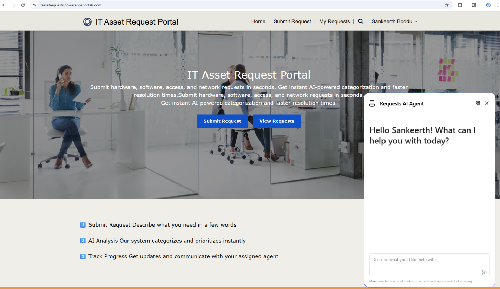
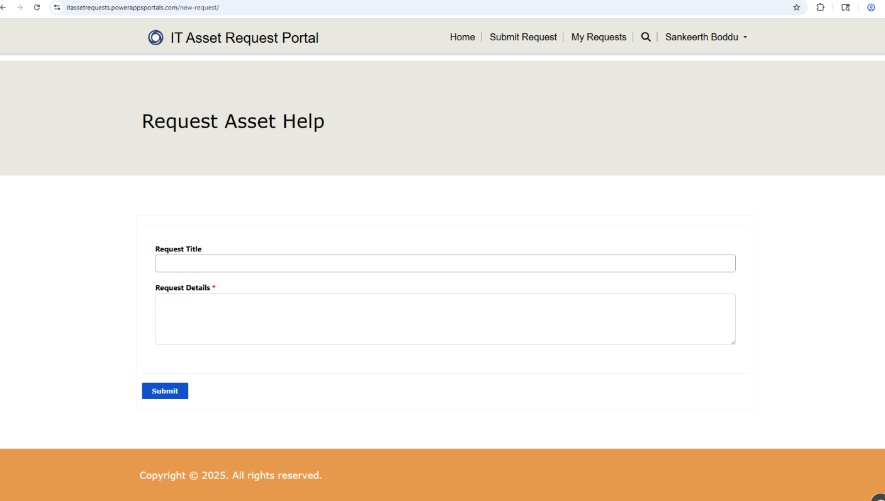
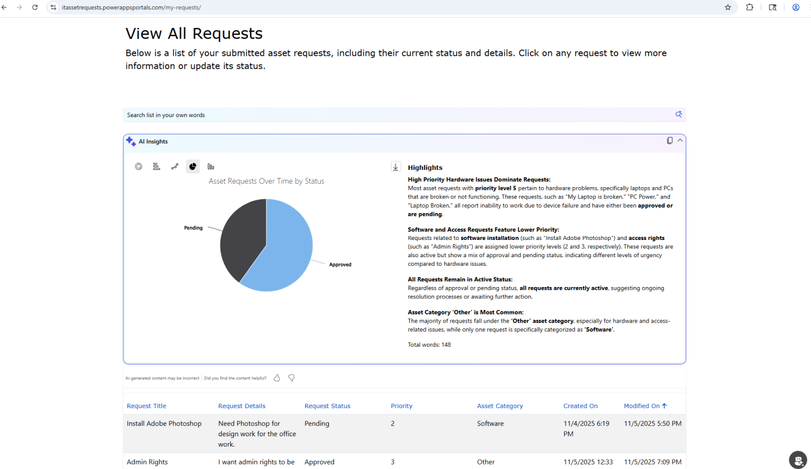
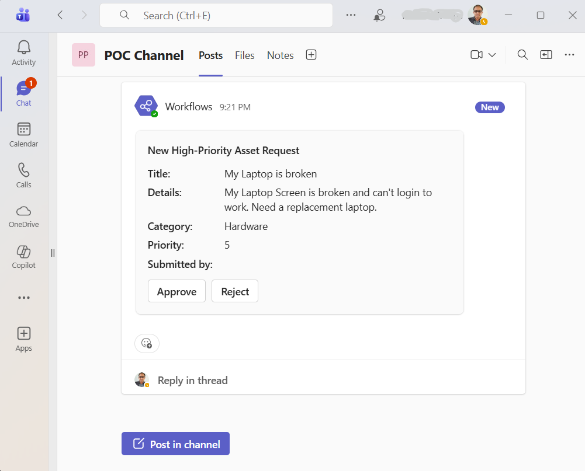
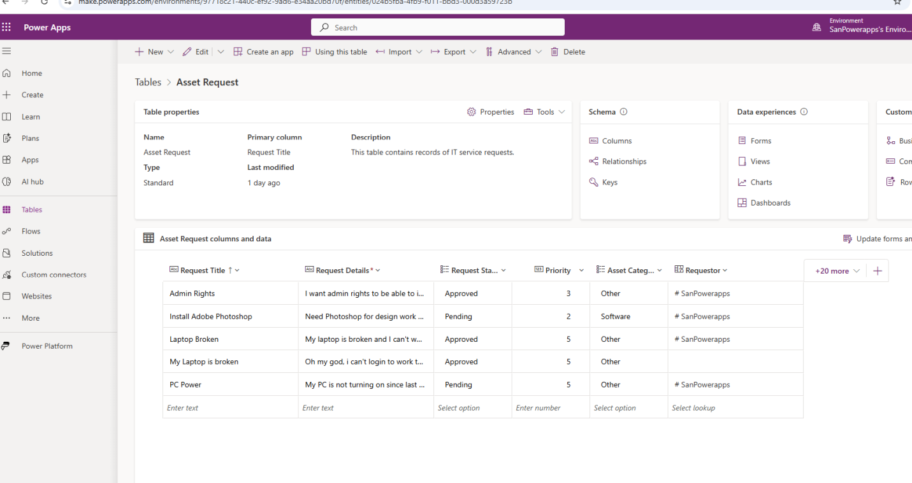
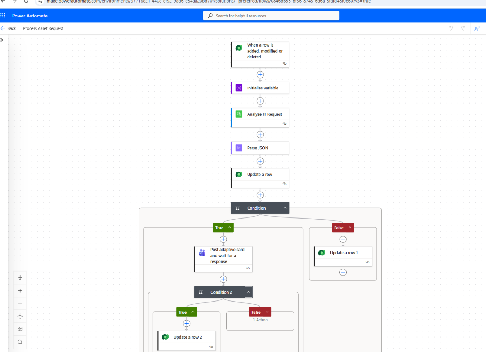
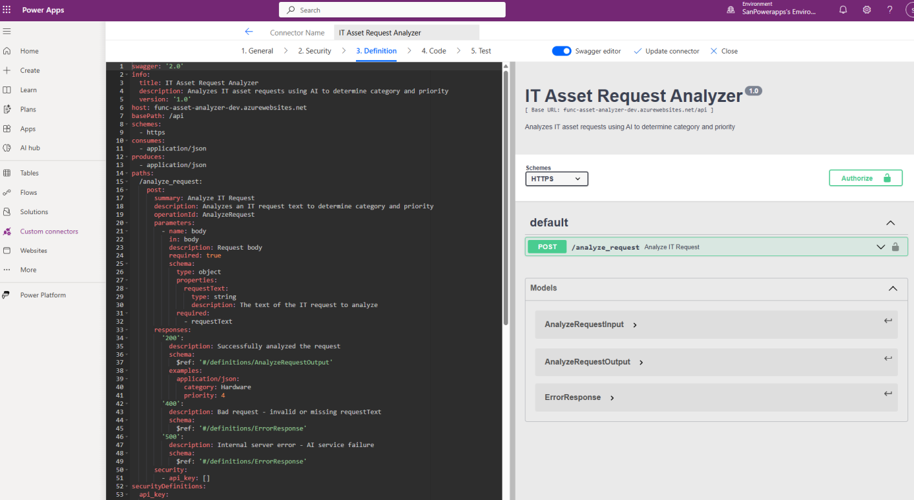
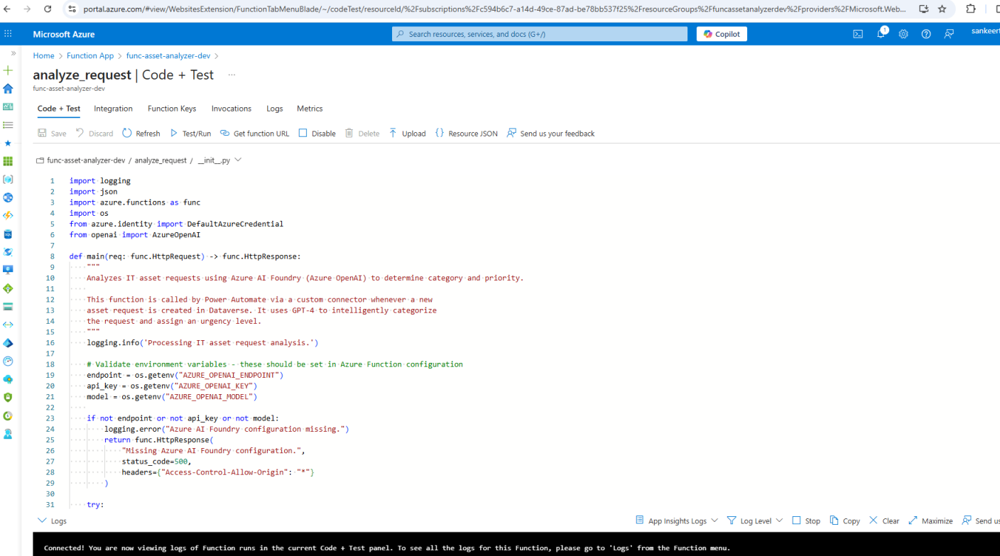
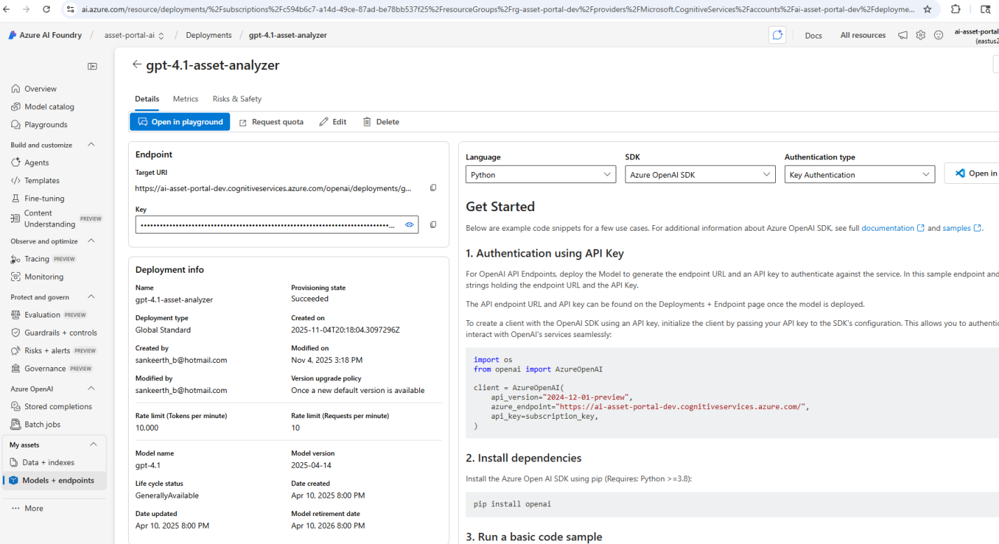
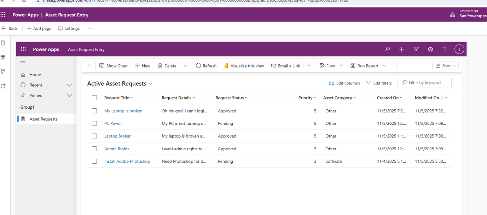

# AI‑Powered IT Asset Request Portal

[](https://github.com/SankeerthBoddu/power-platform-ai-portal/actions/workflows/deploy-azure-function.yml)

A proof‑of‑concept (POC) built to showcase my skills integrating Azure AI Foundry (GPT‑4.1) with Microsoft Power Platform to automatically categorize and prioritize IT asset requests. This README walks through the end‑to‑end flow, key design choices, and what each screenshot demonstrates. It is not production‑hardened.

Tech stack: Azure Functions (Python) • Azure OpenAI • Power Automate • Dataverse • Power Pages • Power Apps • OpenAPI

> Scope: Demonstration POC. For production, add:
> - Secrets in Azure Key Vault + managed identities
> - RBAC/least privilege across Dataverse, Function, and Connector
> - Observability (App Insights logs/metrics), alerts, dashboards
> - Strict validation, rate limiting, and abuse protection on the API
> - Tests (unit/integration), backup/retention, and DLP/compliance review

---

## 1) User experience

1. Home page (Power Pages)
   - Modern hero with two clear calls to action: Submit Request and View Requests
   - Public page; sign‑in transitions users into secure experience
   
   

2. Submit Request form
   - Ultra‑simple: Title + Details; AI fills Category/Priority/Status automatically
   - Form posts to Dataverse with the current user stamped as Requestor
   
   

3. My Requests with AI insights
   - List of the user’s own records (row‑level security)
   - AI category/priority surfaced; details page includes comments thread
   
   

---

## 2) How it works

1. User submits the form (Power Pages → Dataverse row created)
2. Dataverse create event triggers a cloud flow (Power Automate)
3. Flow calls a custom connector (OpenAPI) → Azure Function endpoint
4. Azure Function (Python) calls GPT‑4.1 in Azure AI Foundry with a structured prompt
5. AI returns JSON: { category: <label>, priority: <1‑5> }
6. Flow maps the category label to Dataverse choice integer value and updates the row
7. Optional branch: High priority routes to approval in Teams (Adaptive Card approval)
   
   
   Approval happens directly in Teams; the flow continues based on the approver’s response.
8. User refreshes “My Requests” and sees AI fields populated

Typical end‑to‑end latency: ~3–5 seconds.

---

## 3) Architecture at a glance

Serverless, event‑driven architecture with strict separation of concerns: UI (Power Pages), Data (Dataverse), Orchestration (Power Automate), API (Custom Connector), Compute (Azure Function), and AI (Azure AI Foundry).

See diagrams and extended notes in `docs/technical-design.md`.

---

## 4) Component deep‑dives (in execution order)

### 4.1 Power Pages (UI)
- Three pages: Home (public), Submit Request (authenticated), My Requests (authenticated)
- Table permissions enforce Create/Read‑own on Asset Request and parent‑based access on Request Comment
- Azure AD/Microsoft sign‑in; user mapped to Contact → used for row‑level security

What the screenshot shows: clean, mobile‑friendly UI and the intended user journey from submit → track.

### 4.2 Dataverse (Data layer)
- Tables: Asset Request (Title, Details, Category choice, Priority int, Status choice, Requestor lookup) and Request Comment
- Relationship: Asset Request (1) ↔ (N) Request Comment
- Row‑level security: queries filtered by Requestor = current user


Highlights: AI‑populated fields (Category/Priority) live alongside user inputs; schema supports auditing and approvals.

### 4.3 Power Automate (Orchestration)
- Trigger: When Asset Request is created
- Action: Call Custom Connector → Azure Function
- Transform: Switch maps AI label → Dataverse choice integer
- Update: Writes AI results back to the same row; optional approval branch for high priority (posts a Teams Adaptive Card for manager approval)


Highlights: deterministic mapping, retry policies, and clean separation between orchestration and compute.

### 4.4 Custom Connector (API contract)
- OpenAPI 3.0 spec in `power-platform/connectors/request-analyzer-api.json`
- Base URL → Azure Function; header‑based API key; request/response JSON schemas


Highlights: reusable contract consumed by both Power Automate and Power Apps; type‑safe design-time experience.

### 4.5 Azure Function (Python compute)
- HTTP POST endpoint validates payload and calls Azure OpenAI SDK
- Prompt engineering returns strictly structured JSON: category (enum) + priority (1‑5)
- Robust error handling (timeouts, validation, fallback) and CORS for Power Platform


Highlights: serverless cost model, observability via logs, and production‑grade error handling.

### 4.6 Azure AI Foundry (Model hosting)
- GPT‑4.1 deployment (Global Standard), endpoint + key consumed by the Function
- Chosen for reliability and accuracy on structured outputs


Highlights: enterprise deployment of GPT‑4.1 with managed scaling and access controls.

### 4.7 Power Apps (Admin experience)
- Canvas app for IT staff to manage all requests with elevated permissions
- Filters, edits, and visualizations against the same Dataverse tables


Highlights: admin‑only view for status updates and bulk actions.

---

## 5) Security & reliability (what’s built in)

- Authentication: Azure AD / Microsoft account for portal users
- Authorization: Dataverse row‑level security via Requestor; parent‑based access for comments
- API protection: header API key on Custom Connector, HTTPS everywhere, CORS on Function
- Resilience: retry policies in flow, structured error responses from Function
- Observability: logs and flow run history for traceability

---

## 6) Extensibility (one‑liners)

- MCP server: expose Dataverse request data as context to Microsoft 365 Copilot for natural‑language queries
- Chatbot: add Power Virtual Agents to accept requests and report status via Teams or the portal
- Analytics: connect Power BI to Dataverse for live dashboards (categories, SLAs, throughput)

---

## 7) CI/CD

GitHub Actions workflow `/.github/workflows/deploy-azure-function.yml` automatically packages and deploys the Azure Function to Azure on push to `main` (uses a publish profile stored as repository secret).

---

## 8) Repository map

```
├─ azure-function/              # Python HTTP trigger calling GPT‑4.1
│  └─ analyze_request/          # Function implementation
├─ power-platform/
│  └─ connectors/request-analyzer-api.json  # OpenAPI spec
├─ docs/
│  ├─ technical-design.md       # Architecture notes & diagrams
│  ├─ dataverse-schema.md       # Table definitions
│  └─ TECHNICAL_REFERENCE.md    # API contracts & flows
└─ images/                      # Screenshots referenced above
```

---

Built to demonstrate: Python back‑end skills, Azure AI integration, Power Platform mastery, API design, and clean enterprise architecture.